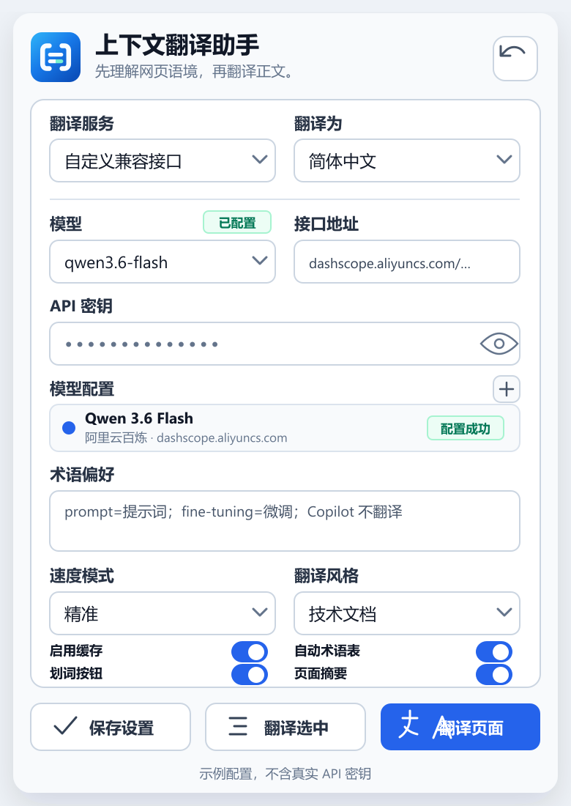
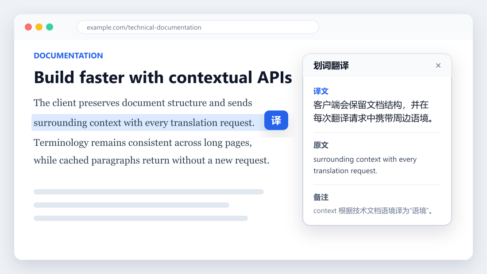
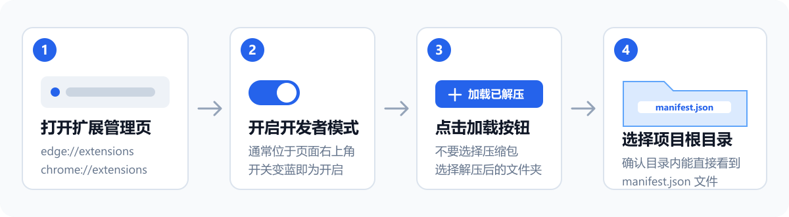

<div align="center">
  

  <h1>上下文翻译助手</h1>

  <p><strong>先理解网页语境，再翻译正文。</strong></p>

  <p>一个轻量、无构建步骤的 Edge / Chrome 网页翻译扩展，重点优化译文准确性与长页面处理速度。</p>

  <p>
    
    
    
    
  </p>

  <p>
    <a href="#-快速安装">快速安装</a> ·
    <a href="#-首次配置">首次配置</a> ·
    <a href="#-使用方法">使用方法</a> ·
    <a href="#-常见问题">常见问题</a>
  </p>
</div>

---

## ✨ 项目特点

| 方向 | 实现方式 |
| --- | --- |
| **更准确** | 读取页面标题、正文结构、标题层级、meta 信息和段落位置，再结合术语偏好、页面摘要与翻译风格生成译文 |
| **更快速** | 可选极速模式、批量请求、本地缓存和 Chrome 内置翻译；短页面会跳过不必要的语境预处理 |
| **更轻量** | 原生 HTML / CSS / JavaScript + Manifest V3，不依赖 React、Vue 或打包工具，下载后可直接加载 |
| **更易读** | 保留原网页 DOM 结构，只替换文本节点；支持原文与译文往返切换，不把模型返回内容当作 HTML 注入 |

<p align="center">
  
</p>
<p align="center"><sub>弹窗界面预览，示例内容不含真实 API 密钥</sub></p>

## 🧩 已有功能

- **整页翻译**：提取当前页面可见正文，分批翻译并保留原页面布局。
- **划词翻译**：选中文字后点击页面内“译”按钮，也可使用弹窗按钮或右键菜单。
- **上下文分析**：使用 Mozilla Readability 识别主体内容，并生成轻量 `pageProfile` 辅助模型选型与提示词构建。
- **后台术语表**：在需要时自动提取产品名、专有名词、缩写和技术词，不打断阅读流程。
- **页面摘要**：长页面、技术页和产品页可先生成主题摘要，减少正文截断造成的歧义。
- **速度模式**：极速模式优先速度和批量；精准模式保留更多上下文并提供更稳健的重试。
- **翻译风格**：通用自然、技术文档、正式商务、自然口语、学术论文、产品介绍。
- **多模型配置**：可保存多套模型、接口地址和 API 密钥，并显示配置成功、配置失败、验证中或待核验状态。
- **自动路由**：`Auto` 会根据速度模式、页面类型、文本规模和语言方向选择合适的可用模型。
- **本地缓存**：重复段落优先命中缓存，减少等待时间与 API 消耗。
- **失败回退**：批量返回格式异常时会按速度模式决定是否重试或逐条补译。
- **不确定标记**：精准模式下可对歧义译文显示低干扰问号提示，悬停查看原因。

<p align="center">
  
</p>
<p align="center"><sub>划词后保留原文高亮，并在可拖动面板中显示译文、原文和可选备注</sub></p>

## 🚀 快速安装

### 1. 下载项目

使用 Git 克隆：

```bash
git clone https://github.com/H-YHJ/html-translation-tool.git
```

也可以在 GitHub 页面点击 **Code → Download ZIP**，下载后先完整解压。浏览器不能直接加载 ZIP 压缩包。

### 2. 打开扩展管理页

- Edge：在地址栏输入 `edge://extensions`
- Chrome：在地址栏输入 `chrome://extensions`

### 3. 加载扩展

1. 打开页面上的**开发人员模式**。
2. 点击**加载解压缩的扩展**或**加载已解压的扩展程序**。
3. 选择项目根目录 `html-translation-tool`。
4. 确认所选目录内可以直接看到 `manifest.json`，不要选择 `src` 子目录。

<p align="center">
  
</p>

### 4. 固定到工具栏

点击浏览器工具栏上的扩展图标，将**上下文翻译助手**固定到工具栏。之后点击蓝色“语境窗口”图标即可打开弹窗。

> [!IMPORTANT]
> 修改扩展文件后，需要回到扩展管理页点击**重新加载**，并刷新已经打开的网页。否则可能看到 `Extension context invalidated.`。

## 🔑 首次配置

首次打开默认显示**自定义兼容接口**。推荐按下面顺序配置：

1. 在**模型**中选择常见模型，或输入服务商提供的准确模型 ID。
2. 填写兼容 OpenAI Chat Completions 的**接口地址**。
3. 填写对应的 **API 密钥**。
4. 点击**保存设置**，等待模型配置显示**配置成功**。
5. 选择目标语言、速度模式和翻译风格。
6. 打开普通 `http://` 或 `https://` 网页，点击**翻译页面**。

保存或修改模型配置时，扩展会发送一次最多生成 1 token 的最小请求，用于核验密钥、接口和模型是否匹配。这个过程可能产生极少量 API 用量。

### 常见兼容接口

| 服务 | Chat Completions 接口地址 | 模型填写方式 |
| --- | --- | --- |
| DeepSeek | `https://api.deepseek.com/chat/completions` | 填写账户当前可用的模型 ID |
| 阿里云百炼 | `https://dashscope.aliyuncs.com/compatible-mode/v1/chat/completions` | 填写百炼控制台已开通的模型 ID |
| OpenAI | `https://api.openai.com/v1/chat/completions` | 填写 API 账户当前可用的模型 ID |
| OpenRouter | `https://openrouter.ai/api/v1/chat/completions` | 使用 `provider/model` 格式的模型 ID |
| 其他服务 | 服务商提供的兼容地址 | 以服务商文档为准 |

模型名称和可用权限可能随服务商更新而变化。预设列表用于快速填写，最终以你的账户实际可用模型为准。

### 不使用 API 密钥

在支持 Translator API 的 Chrome 中，可选择 **Auto + 极速**。扩展会优先尝试 Chrome 内置翻译，首次使用某个语言方向时可能需要下载语言包。

Edge 或不支持该能力的 Chrome 不能保证无密钥翻译。Chrome 内置翻译不可用时，`Auto` 会回退到已经核验成功的模型配置。

## 📖 使用方法

### 翻译整个页面

打开扩展弹窗，点击**翻译页面**。扩展会读取可见文本、按批次翻译并写回原文本节点。完成后可点击右上角的切换按钮，在原文和已有译文之间往返切换，无需重新请求。

### 翻译选中文字

1. 在网页中选中一段文字。
2. 点击选区旁边的蓝色**译**按钮，或打开弹窗点击**翻译选中**。
3. 也可以右键选择**用上下文翻译助手翻译**。

划词面板会显示译文和原文；模型提供备注时一并显示。面板支持拖动，原选区会保持浅蓝高亮，便于返回定位。

### 选择速度模式

| 模式 | 适合场景 | 处理策略 |
| --- | --- | --- |
| **极速** | 日常浏览、短文本、新闻和 UI 文案 | 优先 Chrome 内置翻译或快速模型，扩大批量，跳过摘要和自动术语预处理，减少补译 |
| **精准** | 技术文档、论文、产品页和长文章 | 使用更多页面上下文，按需生成摘要与术语表，并提供更稳健的重试 |

想进一步提速时，建议同时开启缓存，并为极速模式配置 Flash、Mini、Turbo 等低延迟模型。想提高专业文本一致性时，建议使用精准模式、技术文档或学术论文风格，并在术语偏好中固定关键译法。

## 🧠 翻译逻辑

```text
读取可见文本
    ↓
识别网页主体与页面类型
    ↓
生成 pageProfile，按需准备摘要和术语表
    ↓
命中本地缓存，剩余内容分批翻译
    ↓
校验返回格式，按模式重试或补译
    ↓
仅替换对应文本节点，保留页面结构
```

为了提升准确率，缓存键会保留站点、标题、段落位置和术语等必要信息；为了提升命中率，不会把整段页面样本全部塞入缓存键。

## 🔒 隐私与权限

- API 密钥只保存在浏览器扩展的本地 `chrome.storage.local` 中，不会写入仓库文件或显示在模型配置列表里。
- 待翻译文本会发送到你选择的模型接口；请遵守对应服务商的隐私政策，不要翻译不应上传的敏感内容。
- 翻译缓存保存在当前浏览器的扩展本地存储中。
- 扩展需要访问 `http://*/*` 和 `https://*/*`，用于读取普通网页文本，并允许用户填写自定义 HTTP / HTTPS 模型接口。
- 请勿把 API 密钥提交到 GitHub、截图或问题反馈中。

## 🛠️ 常见问题

| 现象 | 原因与处理方法 |
| --- | --- |
| `Extension context invalidated.` | 扩展代码已重新加载，但当前网页仍在运行旧脚本。刷新当前网页后再试。 |
| 点击翻译没有反应 | 确认当前页面是普通 `http://` 或 `https://` 网页。`edge://`、`chrome://`、扩展商店、新标签页、浏览器设置页和内置 PDF 查看器不支持内容脚本。 |
| 找不到扩展弹窗 | 在扩展管理页确认没有红色错误，并从工具栏扩展菜单中固定本扩展；也可在扩展详情页打开**扩展选项**。 |
| 显示 `401` | API 密钥无效或已过期。重新复制密钥，注意不要带空格。 |
| 显示 `403` | 当前密钥没有访问该模型的权限。检查模型是否已开通。 |
| 显示 `404` | 接口地址或模型 ID 不正确。确认地址包含正确的 Chat Completions 路径。 |
| 显示 `429` | 请求频率受限、额度不足或账户不可用。稍后重试或检查服务商额度。 |
| 翻译很慢 | 切换为极速模式、开启缓存、选择低延迟模型；不需要专业语境时可关闭页面摘要和自动术语表。 |
| 首次极速翻译等待较久 | Chrome 可能正在下载对应语言包。下载完成后，同一语言方向的后续翻译会更快。 |
| 页面提示没有正文 | 当前页面可能主要由 Canvas、Shadow DOM、图片、字幕或动态组件构成，现版本只处理可读取的文本节点。 |

## 🧱 项目结构

```text
html-translation-tool/
├─ assets/                  扩展图标
├─ docs/                    文档与 README 图片
├─ src/
│  ├─ background.js         接口请求、缓存、模型核验与自动路由
│  ├─ contentScript.js      页面解析、批量翻译、划词面板与文本替换
│  ├─ popup.html            弹窗结构
│  ├─ popup.css             弹窗样式
│  ├─ popup.js              设置、模型配置与页面操作
│  └─ shared.js             provider、默认设置与共享路由逻辑
├─ vendor/                  Mozilla Readability
└─ manifest.json            Manifest V3 扩展清单
```

项目没有构建步骤。修改源文件后，直接在扩展管理页重新加载即可。

### 基础检查

```powershell
node --check src\shared.js
node --check src\popup.js
node --check src\contentScript.js
node --check src\background.js
node -e "JSON.parse(require('fs').readFileSync('manifest.json', 'utf8')); console.log('manifest ok')"
```

## 🙏 参考与致谢

- [Mozilla Readability](https://github.com/mozilla/readability)：主体正文识别与文章级上下文提取。
- [Read Frog](https://github.com/mengxi-ream/read-frog)：上下文提取、批处理与缓存的产品思路。
- [FluentRead](https://github.com/Bistutu/FluentRead)：多模型配置和沉浸式阅读体验。
- [XTranslate](https://github.com/ixrock/XTranslate)：划词、右键菜单和页面动作入口。
- [context-based-translator](https://github.com/rfeng550/context-based-translator)：上下文翻译与备注展示方向。

当前实现保持原生 MV3 架构，并未直接引入上述项目的大型框架代码。
